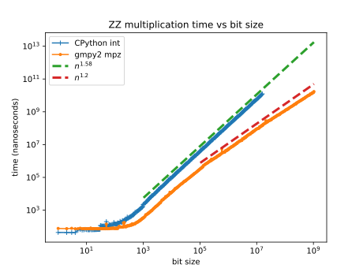
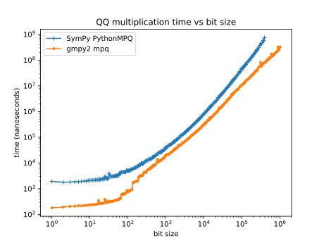
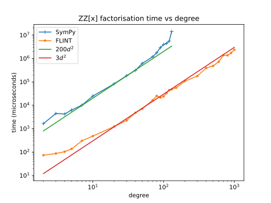

Towards a new SymPy: part 2 - Polynomials
=========================================

This is the second part of a series of posts on big changes for SymPy with
particular focus on speed. The other posts in this series can be found at
:ref:`new sympy`. The first post outlined what I consider to be the three
core subsystems of SymPy:

1. Robust numerical evaluation (``sympy.core.evalf``)
2. The symbolic subsystem (``sympy.core.basic``)
3. The computational algebra subsystem (``sympy.polys``)

In relation to the computational algebra subsystem, there are three ways in
which SymPy can be made faster:

1. Improve/extend some of the algorithms and features.
2. Make more use of the computational algebra subsystem in the rest of SymPy.
3. Make use of FLINT which is a fast C library for computational algebra.

This post will describe SymPy's computational algebra system for polynomials
and how each of these steps could be applied to speed up SymPy. I will talk a
bit about FLINT and python-flint but I will also write a separate post about
those because I know that some people will be more interested in using
python-flint than SymPy itself and I hope to encourage them to contribute to
python-flint.

As before I am writing this with the intention that it should be to some extent
understandable to non SymPy developers. The primary intended audience though is
other SymPy developers because I want them to understand the significance of
the work done so far and the changes that I think are needed for the future.
This post is quite long mainly because there are a lot of details about the
computational algebra subsystem that I want the intended audience to
understand.

Integers and rationals
----------------------

First, I will give a brief overview of the computational algebra subsystem. In
SymPy the computational algebra subsystem is located in the ``sympy.polys``
module. The lowest level of this system are the "domains" which are objects
that represent rings and fields. Briefly a ring is a set of "elements" that can
be added and multiplied and a field is a ring in which it is also possible to
divide any two elements (except 0). The most well known examples of each are
the ring of integers :math:`\mathbf{Z}` and the field of rational numbers
:math:`\mathbf{Q}`.

Engineers and scientists (rather than pure mathematicians) might wonder why we
need to distinguish carefully between e.g. the "ring" of integers or the
"field" of rationals and worry about whether or not division is "possible". In
some sense we can always divide two integers (except 0) and just get a rational
number. Certainly in SymPy's *symbolic* subsystem there is no difficulty in
dividing two integers although we do need to be careful to divide SymPy's
``Integer`` objects and not Python's ``int`` objects (whose division operator
gives ``float``)::

    >>> from sympy import Integer
    >>> Integer(1)/Integer(2)  # dividing Integer gives Rational
    1/2
    >>> 1/2  # dividing ints gives floats
    0.5

The basic reasons that we need to distinguish carefully between rings and
fields and between :math:`\mathbf{Z}` and :math:`\mathbf{Q}` specifically are
not particularly deep or mathematical but rather purely *computational*.
Efficient computing means having well defined types, representations and
operations. On a very basic level the representation of an integer is a
sequence of bits and the representation of a rational number is a pair of
integers. Arithmetic operations manipulate these representations and so an
efficient arithmetic heavy algorithm needs to use a well defined representation
for its elementary types. If we choose our representation to be
:math:`\mathbf{Z}` then we cannot represent :math:`1/2` without converting to a
different representation and so (inexact) division is not allowed. Of course we
can always convert any element of :math:`\mathbf{Z}` to an element of
:math:`\mathbf{Q}` but this conversion is not a free operation and the
representation as an element of :math:`\mathbf{Q}` would be less efficient if
actually all of our elements are integers and if we do not need to divide them.

The other reason that we need to distinguish between e.g. :math:`\mathbf{Z}`
and :math:`\mathbf{Q}` in particular or more generally between different
"domains" is that we usually want to use different algorithms for different
domains. For example, the most efficient algorithm for inverting a matrix or
solving a linear system of equations over :math:`\mathbf{Z}` is different from
the most efficient algorithm for doing the same over :math:`\mathbf{Q}`. Often
the algorithms will convert to different domains for example to invert a matrix
of integers we might convert to :math:`\mathbf{Q}` and use a division-based
algorithm. Alternatively to invert a matrix of rational numbers we might factor
out denominators and convert to a matrix over :math:`\mathbf{Z}` before using a
fraction-free algorithm for inverting a matrix over :math:`\mathbf{Z}`.

In SymPy's domain system, there are domain objects like ``ZZ`` and ``QQ`` that
represent :math:`\mathbf{Z}` and :math:`\mathbf{Q}` respectively. These domain
objects are used to construct elements of the domain and to convert between
domains e.g.::

    >>> from sympy import ZZ, QQ
    >>> QQ(2,3)  # construct an element of QQ
    MPQ(2,3)
    >>> q = QQ(2)  # construct an integer-valued element of QQ
    >>> q
    MPQ(2,1)
    >>> z = ZZ.convert_from(q, QQ)  # convert from QQ to ZZ
    >>> z
    2
    >>> type(z)
    <class 'int'>

In this example we construct the rational number :math:`2/3`. Its
representation is the ``MPQ`` type which is a pure Python implementation of
rational numbers based on Python's ``int`` type (analogous to the Python
standard library ``fractions.Fraction`` type). The representation for ``ZZ``
uses Python's ``int`` type.

GMP and gmpy2
-------------

I mentioned the two domains ``ZZ`` and ``QQ`` above and I will describe the
other domains below. Since these two domains are absolutely foundational it is
worth discussing their implementation a bit first because it is important to
understand the role that gmpy2 and the underlying GMP C library play in this.
If gmpy2 is installed then SymPy will use its ``mpz`` and ``mpq`` types for
``ZZ`` and ``QQ`` respectively. These are based on the underlying GMP C
library::

    >>> from sympy import ZZ, QQ
    >>> ZZ(2)  # pip install gmpy2 to see this
    mpz(2)
    >>> QQ(2,3)
    mpq(2,3)

Here are plots that can compare timings for multiplication of integers with and
without gmpy2 for different bit sizes:

For small integers ``mpz`` is about the same speed as Python's ``int`` type.
Potentially ``mpz`` is actually a little slower for very small integers just
because CPython's ``int`` is heavily micro-optimised for small integers. In
Python all integers use a single arbitrary precision type ``int`` which is
unusual among programming languages. Since most integers are small, CPython
tries to optimise for this case. Possibly also CPython can do some
optimisations with ``int`` that it cannot do with "third party types" like
gmpy2's ``mpz``.

For larger integers (bigger than machine precision) both ``mpz`` and ``int``
will represent an integer using multiple "digits" although the digits are
referred to as "limbs" in GMP. CPython uses 30-bit limbs because its
implementation of integer arithmetic is designed to be portable "generic C"
that can be compiled by any compiler. By contrast GMP's implementation is
designed to be as fast as possible at all costs and so it uses handcrafted
assembly code for many different CPU architectures. In CPU specific assembly it
is possible to access instructions like ``mulx`` or to read the CPU's carry
flag after an addition etc. These things are essential for being able to use
64-bit limbs but are not available in generic C. GMP's ``mpz`` type therefore
uses 64-bit limbs (as do all widely used fast big integer implementations).

As the bit size increases say to 1000 bits then gmpy2's ``mpz`` becomes a lot
faster than CPython's ``int``. At this bit size the difference in speed to
multiply two integers is something like 10x and is primarily due to the fact
that ``mpz`` uses 64-bit limbs whereas ``int`` uses 30-bit limbs. This smaller
limb-size essentially means a 4x increase in the number of CPU-level operations
needed for a big integer multiplication.

For very large integers gmpy2's ``mpz`` is *much* faster than ``int``. This is
because GMP has a whole hierarchy of algorithms for different bit sizes.
CPython's ``int`` type tops out at the Karatsuba algorithm which is also used
by GMP for intermediate bit-sizes but GMP has more complex algorithms that are
used for larger bit sizes. At these large bit sizes the difference in speed
between ``mpz`` and ``int`` can be enormous. Here we focus on multiplication
which is probably more favourable to ``int`` than some other operations would
be. In fact the slowness of some algorithms used by CPython's ``int`` type was
even recently considered to be a security vulnerability to the extent that
certain operations were disabled:

https://discuss.python.org/t/int-str-conversions-broken-in-latest-python-bugfix-releases/18889

That did lead to some work on improving CPython's ``int`` algorithms but the
disabled operations remain disabled even though the algorithms have been
improved to some extent::

    >>> import math
    >>> x = math.factorial(1559)
    >>> print(x)
    ...
    ValueError: Exceeds the limit (4300 digits) for integer string conversion;
    use sys.set_int_max_str_digits() to increase the limit

This plot shows timings for multiplication of rational numbers with and without
gmpy2 for different bit sizes:

For small rational numbers gmpy2's ``mpq`` type is about 10x faster than
SymPy's pure Python ``MPQ`` type when both are used from Python code for
multiplication as shown here. The difference can be up to about 20x for general
arithmetic-heavy algorithms. This difference is primarily due to gmpy2
implementing this in C and SymPy's ``PythonMPQ`` being implemented in pure
Python. For intermediate bit sizes gmpy2's ``mpq`` is only about 2-3x faster
because the bulk of the time is spent in ``gcd`` and CPython's ``math.gcd``
function is implemented in C (the Python overhead is less significant at larger
bit sizes). The difference in timings here most likely reflects GMP being more
microoptimised with CPU-specific assembly, 64-bit limbs etc. At larger bit
sizes gmpy2's ``mpq`` becomes asymptotically faster and this is again due to
asymptotically faster integer multiplication: every integer operation including
``gcd`` will ultimately reduce to multiplication at large sizes.

What this all means is that for some operations SymPy is a lot faster when
gmpy2 is installed. Some people reading this might think that it seems absurd
to worry about the performance of megabyte sized integers but many symbolic
algorithms will generate much larger integers than might be expected. Also when
gmpy2 is installed it will be used by mpmath and so it speeds up SymPy's
numeric subsystem as well as the computational algebra subsystem.

The symbolic subsystem is the only one of the three core subsystems of SymPy
that does not use gmpy2. I did recently look at changing SymPy to have the
symbolic ``Integer`` and ``Rational`` types use ``mpz`` and ``mpq`` when gmpy2
is installed but hit a stumbling block that the symbolic subsystem allows
"unevaluated rationals" whose gcd is not cancelled::

    >>> from sympy import Rational
    >>> Rational(3, 6, 1)
    3/6

That is apparently documented behaviour. This is not really a useful feature
though because the symbolic subsystem could also represent the same thing using
``Mul`` and ``Pow``. Having the symbolic ``Rational`` type use gmpy2's ``mpq``
for its internal representation would break these "unevaluated rationals" (that
should be done anyway though).

One of the nice things about the computational algebra subsystem is that it is
possible to swap out the implementation of the domain objects like this. So on
the one hand SymPy and its only hard dependency mpmath can be used as entirely
pure Python code without gmpy2. This is useful for many people who do not need
the performance of gmpy2 and do not want to install it or cannot install it for
example if they use a different Python implementation like PyPy. On the other
hand if gmpy2 is installed then SymPy will use it and will be a *lot* faster
for some operations but with *no other observable change in behaviour*.

(Contrast this last point with my previous comments about the difficulty of
SymPy using SymEngine to speed up the symbolic subsystem in :ref:`symengine`)

The domain system
-----------------

I have talked a lot about the two domains ``ZZ`` and ``QQ`` but there are many
more domains in SymPy. You can read more about them here:

https://docs.sympy.org/latest/modules/polys/domainsintro.html

People who are familiar with computational algebra will recognise these
domains:

- ``GF(n)``: integers mod ``n`` (the name ``GF`` is misleading)
- ``ZZ``: the integers
- ``QQ``: the rational numbers
- ``ZZ_I``: Gaussian integers
- ``QQ_I``: Gaussian rationals
- ``QQ(a)``: algebraic number field generated by ``a``
- ``RR``: the real numbers (floats with fixed precision provided by mpmath)
- ``CC``: the complex numbers (complex floats with fixed precision)
- ``K[x]``: polynomials in e.g. ``x`` with coefficients in another domain ``K``
- ``K[x,y]``: multivariate polynomials in ``x`` and ``y``.
- ``K(x,y)``: rational functions (ratios of polynomials) in ``x`` and ``y``.
- ``EX``: The expression domain (basically the symbolic subsystem)
- ``EXRAW``: The raw expression domain.

There are more domains but these are the most important ones. Perhaps the
easiest way to see what the domains are for is by using the
``construct_domain`` function. This function is used internally by SymPy to
choose a domain that could represent some expression from the symbolic
subsystem in the domain system::

    >>> from sympy import *
    >>> x, y = symbols('x, y')
    >>> construct_domain([1, 2])
    (ZZ, [mpz(1), mpz(2)])

Here we asked for a domain that could represent both ``1`` and ``2``. What was
returned was the domain ``ZZ`` (meaning the integers) and a list of two
elements representing ``1`` and ``2`` in that domain (as gmpy2 ``mpz`` objects
in this case). We can try more examples::

    >>> construct_domain([x**2, 1])
    (ZZ[x], [x**2, 1])
    >>> construct_domain([x**2, y])
    (ZZ[x,y], [x**2, y])
    >>> construct_domain([x**2, y/x])
    (ZZ(x,y), [x**2, y/x])
    >>> construct_domain([sin(x), y])
    (ZZ[y,sin(x)], [(sin(x)), y])
    >>> construct_domain([x, 2.0])
    (RR[x], [x, 2.0])
    >>> construct_domain([x/2, 1])
    (QQ[x], [1/2*x, 1])

In each case ``construct_domain`` tries to find the simplest domain that can
represent all the expressions.

Sparse and dense polynomials
----------------------------

Importantly the polynomial domains are always implemented as "sparse"
polynomials. This means that only nonzero terms are stored. This example
contrasts the sparse and dense representations of polynomials::

    >>> from sympy import QQ, symbols
    >>> x, y = symbols('x, y')
    >>> e = x**10 + y
    >>> p_sparse = QQ[x,y].convert(e)
    >>> p_dense = e.as_poly()

This is how the sparse ``PolyElement`` and the dense ``Poly`` usually look::

    >>> p_sparse
    x**10 + y
    >>> p_dense
    Poly(x**10 + y, x, y, domain='ZZ')

This is what their internal representations look like::

    >>> dict(p_sparse) # internal sparse representation
    {(0, 1): mpq(1,1), (10, 0): mpq(1,1)}
    >>> e.as_poly().rep.rep  # internal dense representation
    [[mpz(1)], [], [], [], [], [], [], [], [], [], [mpz(1), mpz(0)]]

Here the sparse representation is a dictionary mapping exponent tuples to
coefficients. The dense representation is a list of lists of coefficients. The
empty lists in the dense representation represent zero terms. The dense
representation is described as "dense" because it needs to store zero terms
explicitly.

Integers mod ``n``
------------------

Some domains that people might expect to be find in the domain system are
missing like finite fields of non-prime order e.g. ``GF(2**3)``. Essentially
that is because most SymPy users are not interested in such things and the rest
of the codebase does not need them. Some people have expressed interest in
these and contributions are certainly welcome but I guess it has not happened
because it is not considered high priority and most users who are interested in
such things are more likely to use something like Sage rather than SymPy.

Probably most SymPy users are not interested in ``GF(n)`` (integers mod ``n``)
either but that is there because it is needed for the algorithms in the other
domains. Let me give an example to show how all of this is used::

    >>> from sympy import symbols, factor
    >>> x, y = symbols('x, y')
    >>> e = x**4 - y**4/16
    >>> e
    x**4 - y**4/16
    >>> factor(e)
    (2*x - y)*(2*x + y)*(4*x**2 + y**2)/16

So how does this work? First ``factor`` converts the expression to a polynomial
with coefficients in some domain::

    >>> p = e.as_poly()
    >>> p
    Poly(x**4 - 1/16*y**4, x, y, domain='QQ')
    >>> p.domain
    QQ

Here the ``Poly`` identifies that we have two variables ``x`` and ``y`` and
that the coefficients are in the domain ``QQ`` (the rational numbers). We are
now ready to call the factorisation algorithm. The factorisation algorithm for
polynomials with coefficients in ``QQ`` will first factor out the denominator
``16`` giving a polynomial ``16*x**4 - y**4`` with coefficients in ``ZZ``. We
now want to factorise this but then the algorithm for factorising polynomials
over ``ZZ`` will convert the problem to factorising polynomials over ``GF(p)``
for some prime ``p``. Then we compute the factorisation over ``GF(p)`` and
convert the result back to a factorisation over ``ZZ`` and so on. So the steps
in the computation are (with ``EX`` representing the ordinary symbolic
expressions)::

    EX -> QQ[x,y] -> ZZ[x,y] -> GF(p)[x,y] -> factored -> ... -> EX

The ``...`` here obscures a bunch of complexity that I don't want to get into.
For those familiar with these things the ``Zassenhaus`` algorithm is used by
default but the main weakness is that LLL-based techniques are not implemented
(so worst case is not polynomial time). For everyone else the algorithms used
here are usually good but for certain inputs ``factor`` can be very slow when a
different algorithm would be a lot faster.

The main point of this factorisation example is just to show the significance
of all the different domains including ``GF(p)``. Most SymPy users do not care
about ``GF(p)`` but it is crucial for things that they do care about because it
is used by e.g. ``factor`` which is in turn used by ``solve`` and ``simplify``
and so on.

Algebraic number fields
-----------------------

In this example we get ``EX`` which is what ``construct_domain`` returns when
it gives up::

    >>> construct_domain([sqrt(2), 1])
    (EX, [EX(sqrt(2)), EX(1)])

There is a domain for this but it will not be used by default (we have to pass
``extension=True``)::

    >>> construct_domain([sqrt(2), 1], extension=True)
    (QQ<sqrt(2)>, [ANP([mpq(1,1), mpq(0,1)], [mpq(1,1), mpq(0,1), mpq(-2,1)], QQ), ANP([mpq(1,1)], [mpq(1,1), mpq(0,1), mpq(-2,1)], QQ)])

It might not look nice but that is the domain for the algebraic number field
:math:`\mathbb{Q}(\sqrt{2})`. The ``ANP`` stands for "algebraic number
polynomial". The representation of algebraic number fields always uses a
*primitive element*. This representation is efficient for arithmetic but
computing the primitive element can be expensive which means that it can be
slow to construct the domain. Timings are (on a slow computer)::

    In [10]: %time ok = construct_domain([sqrt(2)], extension=True)
    CPU times: user 26 ms, sys: 0 ns, total: 26 ms
    Wall time: 25.2 ms

    In [11]: %time ok = construct_domain([sqrt(2), sqrt(3)], extension=True)
    CPU times: user 47.4 ms, sys: 0 ns, total: 47.4 ms
    Wall time: 46.3 ms

    In [12]: %time ok = construct_domain([sqrt(2), sqrt(3), sqrt(5)], extension=True)
    CPU times: user 55.2 ms, sys: 0 ns, total: 55.2 ms
    Wall time: 53.9 ms

    In [13]: %time ok = construct_domain([sqrt(2), sqrt(3), sqrt(5), sqrt(7)], extension=True)
    CPU times: user 120 ms, sys: 0 ns, total: 120 ms
    Wall time: 118 ms

    In [14]: %time ok = construct_domain([sqrt(2), sqrt(3), sqrt(5), sqrt(7), sqrt(11)], extension=True)
    CPU times: user 688 ms, sys: 0 ns, total: 688 ms
    Wall time: 686 ms

    In [15]: %time ok = construct_domain([sqrt(2), sqrt(3), sqrt(5), sqrt(7), sqrt(11), sqrt(13)], extens
        ...: ion=True)
    ^C^C
    KeyboardInterrupt

I don't know how long that last command would take but I interrupted it after
about 5 minutes. I have not investigated why it is so slow but I expect that it
can be made faster. I think what it really shows though is that it is a bad
idea to even try to compute the primitive element and that it is better to
represent algebraic number fields differently in the case of having many
algebraic generators.

EX and EXRAW domains
--------------------

There are more domains than listed above but those are the ones that would
usually be created automatically within SymPy when the computational algebra
subsystem is used implicitly. There will always be some situations where the
symbolic subsystem has some expressions that the computational algebra
subsystem cannot represent using a standard ring/field from the list above. In
those situations it will use the ``EX`` or ``EXRAW`` domains. In these domains
the elements are actually just symbolic expressions from the symbolic
subsystem. This provides an escape hatch that allows code that expects to work
with the domains to fall back on using the symbolic subsystem when a more
structured domain cannot be found.

The difference between the ``EX`` and ``EXRAW`` domains is that the elements of
the ``EX`` domain are always simplified using the high-level ``cancel``
function so in this domain ``c = b + a`` is equivalent to writing ``c =
cancel(b + a)`` with ordinary SymPy expressions from the symbolic subsystem.
The effect of ``cancel`` on a symbolic expression is that always rearranges an
expression into a ratio of expanded polynomials and then cancels the polynomial
gcd of the numerator and denominator::

    >>> from sympy import symbols, cancel
    >>> x, y = symbols('x, y')
    >>> e = 1/x + x
    >>> e
    x + 1/x
    >>> cancel(e)
    (x**2 + 1)/x

Calling ``cancel`` on symbolic expressions like this is slow because every call
to to ``cancel`` has to go through the whole process of identifying a
polynomial representation, choosing a domain, converting the expressions into
the domain and then after actually computing the cancelled fraction the result
needs to be convert back to the symbolic subsystem. If this sort of
simplification is wanted then it is always better to use any of the more
structured domains above than to use ``EX`` because it avoids all the cost of
these conversions.

For some algorithms the automatic expansion and cancellation used in ``EX`` is
exactly what is needed as a method of intermediate simplification to speed up a
large calculation and return a result in a mostly canonical form. In some
situations though it is preferrable not to have this cancellation (which in
itself can be slow) and for this the ``EXRAW`` domain is provided. Operations
with the ``EXRAW`` domain are precisely equivalent to operations in the
symbolic subsystem (without calling ``cancel``). All the reasons that it is
difficult to build heavy algorithms over the symbolic subsystem apply to the
``EXRAW`` domain as well. The ``EXRAW`` domain is only really useful for
preserving existing behaviour in a situation where we want to change code that
currently uses the symbolic system to use the computational algebra subsystem
instead. It would almost always be better to use something other than ``EXRAW``
(even if just ``EX``) but if we want to be conservative when making changes
then ``EXRAW`` provides a possible compatibility mechanism.

Using the right domains
-----------------------

Having talked a lot about the domain system above I can now explain how that
relates to things sometimes being slow in SymPy and what can be done to improve
that.

Firstly, when implementing any arithmetic heavy algorithm like solving a
system of linear equations all of the domains described above apart from ``EX``
or ``EXRAW`` are almost always faster than any algorithm that could be
implemented directly with symbolic expressions. The number one reason for
slowness in things like computing the inverse of a matrix is just the fact that
many such algorithms do not use the domain system at all and instead use the
symbolic subsystem.

Secondly, in many cases the ``EX`` domain is used when it would not be
difficult to choose a better domain instead. This is because the mechanism for
constructing domains is quite conservative about what it will accept. An
example would be::

    >>> from sympy import *
    >>> x, y = symbols('x, y')
    >>> construct_domain([x + y])
    (ZZ[x,y], [x + y])
    >>> t = symbols('t')
    >>> x = Function('x')
    >>> y = Function('y')
    >>> construct_domain([x(t) + y(t)])
    (EX, [EX(x(t) + y(t))])

Here the functions ``x(t)`` and ``y(t)`` should be treated the same as the
symbols ``x`` and ``y`` were. A suitable domain can easily be created
explicitly::

    >>> domain = ZZ[x(t),y(t)]
    >>> domain.from_sympy(x(t) + y(t))
    (x(t)) + (y(t))

The problem here is just that the code inside ``construct_domain`` rejects this
domain because it does not want to create a polynomial ring where the
generators have free symbols in common (the ``t`` in this case). The reason for
rejecting this is to try to avoid something like this::

    >>> ZZ[sin(t),cos(t)]
    ZZ[sin(t),cos(t)]

This ``ZZ[sin(t),cos(t)]`` domain is invalid for many situations. the problem
with it is that it is possible to create an expression that should really be
zero but appears not to be zero::

    >>> R = ZZ[sin(t),cos(t)]
    >>> s = R.from_sympy(sin(t))
    >>> c = R.from_sympy(cos(t))
    >>> e = s**2 + c**2 - 1
    >>> e
    (sin(t))**2 + (cos(t))**2 - 1
    >>> R.is_zero(e)
    False
    >>> R.to_sympy(e).trigsimp()
    0

One of the reasons that arithmetic heavy algorithms with domains are so much
faster than with symbolic expressions is because in the domain system any
expression that is equal to zero should be simplified automatically to zero.
Many algorithms need to know whether expressions are zero or not so this is an
extremely useful property. Just treating ``sin(t)`` and ``cos(t)`` as
independent variables in a polynomial ring violates this property. Sometimes
that would be fine but in other situations it could lead to bugs. Therefore
``construct_domain`` refuses to create the ring ``ZZ[sin(t),cos(t)]`` to avoid
bugs. This refusal leads to the ``EX`` domain being used which is much slower
and also potentially subject to precisely the same bugs. The advantage of using
the ``EX`` domain here is mainly just that other code can at least be aware
that the domain is not well defined and can then handle things more
conservatively.

It is perfectly possible to implement a domain that can represent a ring/field
involving both ``sin(t)`` and ``cos(t)``. There are already some kinds of
domains that can do this although they are not used by default and also are not
quite right for what is needed. What we really want is to be able to make a 
more complicated ring like this::

    QQ[sqrt(2),m1,m2,k1,k2,sin(theta),cos(theta),sin(phi),cos(phi)]

In science and engineering the need to work with ``sin`` and ``cos`` is very
common so specialised domains are needed that can handle this for many
different variables and can recognise trig identities etc. SymPy does not yet
have this but adding it would mostly complete the domain system in terms of
being able to represent the sorts of expressions that users typically want to
work with. This would be particularly beneficial for example in the case of
symbolic calculations in mechanics (as in the ``sympy.physics.mechanics``
module) because those calculations involve many systems of linear equations
with ``sin`` and ``cos`` in the coefficients. I have an implementation of a
domain that could represent the ring above using sparse polynomials and
Groebner bases but it is still incomplete.

There are then two common ways that things might become slower than they should
be when using the domain system:

- Sometimes the ``EX`` domain is used conservatively when suitable
  alternative domains are already there and could easily be used.
- Sometimes a suitable domain is not yet implemented (e.g. ``sin/cos``).

In either case the result is that a calculation ends up using the ``EX`` domain
which is a lot slower than any of the other domains. The fixes for thes
problems are simple:

- Improve the logic for deciding which domains are used by default.
- Add new domains that can represent things like ``sin`` and ``cos`` for
  example.

The other common problem is that constructing algebraic fields can be extremely
slow (as shown above). This is unfortunate because after construction algebraic
fields are much faster than alternate representations for the same expressions.
The fix here is to use a different representation for algebraic fields that is
not based on primitive elements but this is not a trivial change.

Most of these changes are not particularly difficult to make but in each case
the impact of making such a change can be far reaching and hard to predict in
full. Each time some calculation is moved from either the symbolic subsystem or
the ``EX`` domain to a more structured domain the most noticeable effect is to
make things (much) faster, and a secondary effect is that it potentially
reduces bugs. The third effect is that it leads to the output of the
calculation being in a "more canonical" form which is a good thing but it is a
change in output in some sense and it is the impact of this change that is hard
to predict. Once a calculation is moved to use a more structured domain though
it then becomes much easier to optimise things in future because the form of
the output is much more predictable and can be preserved exactly under any
change of algorithm.

The Poly system
---------------

The domain system is from a user-interface perspective the lowest level of the
computational algebra subsystem. The next level up are the low-level poly
functions for the ``dup`` (dense univariate polynomial) and ``dmp`` (dense
multivariate polynomial) representations. In the ``dup`` representation a
polynomial is represented as a list of coefficients. There are many functions
with the ``dup_`` prefix for operating on this representation e.g. this is how
you would multiply two polynomial using the symbolic system::

    >>> from sympy import symbols, expand
    >>> x = symbols('x')
    >>> p1 = 3*x + 4
    >>> p2 = 5*x + 6
    >>> p3 = expand(p1*p2)
    >>> p3
    15*x**2 + 38*x + 24

This is how you would do the same with ``dup_mul``::

    >>> from sympy import ZZ
    >>> from sympy.polys.densearith import dup_mul
    >>> p1 = [ZZ(3), ZZ(4)]
    >>> p2 = [ZZ(5), ZZ(6)]
    >>> p3 = dup_mul(p1, p2, ZZ)
    >>> p3
    [mpz(15), mpz(38), mpz(24)]

A multivariate polynomial involving e.g. two symbols ``x`` and ``y`` can be
thought of as a polynomial whose coefficients are polynomials e.g.::

    >>> x, y = symbols('x, y')
    >>> p = x**2*y + x**2 + x*y**2 - x - y
    >>> p.collect(x)
    x**2*(y + 1) + x*(y**2 - 1) - y

Here we could think of ``p`` as a polynomial in ``x`` whose coefficients are
polynomials in ``y``. If a univariate polynomial is represented as a list of
coefficients then a multivariate polynomial can be represented as a list of
lists of coefficients. This is the ``dmp`` representation::

    >>> p.as_poly(x, y).rep.rep
    [[mpz(1), mpz(1)], [mpz(1), mpz(0), mpz(-1)], [mpz(-1), mpz(0)]]

There are many functions like ``dmp_mul`` etc for operating on this
representation. In a simple example like this it looks okay but actually it is 
a very bad idea to use this list of lists (of lists of ...) representation when
we have many more than two variables::

    >>> x0, x1, x2, x3, x4, x5, x6, x7, x8, x9 = syms = symbols('x:10')
    >>> p = x0*x9 - x5*x3 + x6
    >>> p.as_poly(syms).rep.rep
    [[[[[[[[[[mpz(1), mpz(0)]]]]]]]]], [[[[[[[[[mpz(-1)]]]], [[[[]]]]]], [[[[[[mpz(1)]]], [[[]]]]]]]]]]

These deeply nested recursive lists are very inefficient to work with compared
to the flatter sparse representation which in this case looks like::

    >>> dict(ZZ[syms].from_sympy(p))
    {(0, 0, 0, 0, 0, 0, 1, 0, 0, 0): mpz(1), (1, 0, 0, 0, 0, 0, 0, 0, 0, 1): mpz(1), (0, 0, 0, 1, 0, 1, 0, 0, 0, 0): mpz(-1)}

Altogether there are about 500 ``dup_*`` and ``dmp_*`` functions. These
collectively implement just about all of the operations and algorithms that you
might want for doing anything with polynomials and there are in many cases
multiple algorithms for the same operation. It is clear from the design of
these that the intention was at some point to rewrite all of this code in C to
speed things up.

The next level up are the polynomial classes like the ``DMP`` class. The
``DMP`` class wraps up a list of lists in the representation shown above along
with a reference to the associated domain. The ``DMP`` class then provides
around 150 methods that are implemented by calling down to the lower-level
routines.

The next level above that is ``Poly`` which is the main user-facing class for
polynomials. The ``Poly`` class is a wrapper around the ``DMP`` class that
provides a lot of convenience methods for doing things like converting to and
from the symbolic subsystem, and other representations.

These levels ``Poly``, ``DMP`` and the ``dup`` representation can be seen by
creating a ``Poly`` and then looking at its ``rep`` attribute::

    >>> p = Poly(x**2 + 1)
    >>> p          # Poly
    Poly(x**2 + 1, x, domain='ZZ')
    >>> p.rep      # DMP
    DMP([1, 0, 1], ZZ, None)
    >>> p.rep.rep  # dup
    [1, 0, 1]

The final level are the "polys" functions like ``factor``. These are the
highest level functions that are used by most SymPy users and can operate on
expressions from the symbolic subsystem::

    >>> from sympy import factor
    >>> factor(x**2 - 1)
    (x - 1)*(x + 1)

The levels altogether then are:

1. Domains (e.g. ``ZZ``, ``QQ``, ``ZZ[x]``, ``QQ[x]`` etc)
2. Low-level poly functions (e.g. ``dup_mul``, ``dmp_mul`` etc)
3. Polynomial classes (e.g. ``DMP``)
4. High-level ``Poly`` class.
5. Polynomial functions for symbolic expressions (e.g. ``factor``)

The intention was always that some of these levels would be replaced by more
efficient implementations in C but it is not obvious at which level that was
intended to happen. The ``Poly`` class is too high-level and interfaces a lot
with the symbolic subsystem so it is not easy or desirable to rewrite that in
C. The ``dup_`` and ``dmp_`` functions are closely tied to their own
(suboptimal) data representations so without rewriting every single one of them
it would not be possible to swap out this whole layer.

There are two levels that are good candidates for swapping in alternate
implementations wholesale then:

- The domain level
- The ``DMP`` class

At the domain level SymPy already swaps out the implementations of ``ZZ`` and
``QQ`` when gmpy2 is installed but the same could be done for all of the
commonly used domains like ``ZZ[x]``, ``QQ[x]`` etc if the implementations of
these from e.g. python-flint were used. The ``DMP`` class is also a good
candidate for swapping out just because it is nicely self-contained. A wrapper
class could be made like ``FlintDMP`` that wraps a polynomial type from
python-flint and provides the same interface as ``DMP`` currently does. That
would make it easy to swap in a faster implementation of the ``DMP`` class
when python-flint is installed.

Besides swapping out a whole layer the easiest way to make some things faster
would just be to swap out a few key functions that involve expensive algorithms
e.g. like ``dup_zz_factor`` or ``dmp_zz_factor`` which are the base functions
for factorising univariate ot multivariate polynomials in ``ZZ[x]`` or
``ZZ[x,y,...]`` respectively. Swapping out a single function like this is
suboptimal because it implies potentially costly conversions from a more
efficient C representation to e.g. the inefficient ``DMP`` representation but
it would be a very simple change to make and could immediately bring big speed
ups for important operations.

Sparse polynomials
------------------

The system of levels in the polys module that I described above is all nicely
designed and mostly well implemented. There are some algorithms that would be
nice to have like asymptotically fast multiplication and division of
polynomials but mostly it has the pieces and algorithms that are needed. The
big glaring problem with it though is that it is all based on dense polynomials
and the ``DMP`` representation. This is very inefficient for polynomials with
many variables. The system works nicely for univariate polynomials but many of
the algorithms necessarily become inefficient for multivariate polynomials.
Most SymPy users are not really interested in using only univariate polynomials
(e.g. solving equations with only one symbol or something) so this is a
significant limitation.

At some point the mistake of basing everything on dense polynomials was
realised and a new class ``PolyElement`` implementing sparse polynomials was
added. The implementation of ``PolyElement`` is mostly complete and it is used
in many places but not always. For example the domain system always uses
(sparse) ``PolyElement`` but the ``Poly`` class always uses (dense) ``DMP``.

It would be possible to add an equivalent of the ``DMP`` class based on sparse
polynomials that ``Poly`` could use internally. It is not clear if it was
intended that ``PolyElement`` would be that class or if another level was
expected. Looking at the code right now the easiest thing would be to add a new
class in between ``PolyElement`` and ``Poly`` that implements the same
interface as ``DMP`` but using sparse polynomials internally, let's call it
``SMP``. Then ``Poly`` could use ``DMP`` or ``SMP`` internally but ``DMP``
would only ever be used for univariate polynomials. Then the structure would
look like:

1. Domains (``ZZ`` ...)
2. ``dup_*`` (dense) or ``PolyElement`` (sparse)
3. ``DMP`` (dense) or ``SMP`` (sparse)
4. ``Poly`` (dense or sparse internally)
5. ``factor`` etc

It is not completely clear if that is the right thing to do though because
actually many ``Poly`` methods are designed tightly around what makes sense in
the dense representation or around things that only make sense for univariate
polynomials. Probably the interface of ``Poly`` and the signatures and
behaviour of the methods and functions that operate on it would have been
designed differently if sparse and multivariate polynomials had been considered
from the start.

In general it is not really clear to me if it even makes sense to have a
generic interface that covers both univariate and multivariate polynomials
because often the operations that make sense for one case do not make sense for
the other. The fact that all of the low-level code needs to have completely
separate functions for univariate (``dup_*``) and multivariate (``dmp_*``)
polynomials shows that it is not really possible to write generic code that
ignores this distinction.

An alternate scheme for sparse multivariate polynomials could look like:

1. Domains
2. ``PolyElement``
3. ``SPoly`` (sparse version of ``Poly``)

Then depending on context you would choose whether you wanted to use ``Poly``
for univariate polynomials or ``SPoly`` for multivariate polynomials (perhaps
``SPoly`` should be called ``MPoly`` for "multivariate"). This approach would
require more careful design because it would impact more on code that end users
would potentially write rather than just being a rearrangement of internal
code. We would need to decide what e.g. ``expr.as_poly()`` should return and
changing that to ``SPoly/MPoly`` in some cases might not be backwards
compatible so perhaps we need new methods like ``expr.as_mpoly()``.

Polynomial GCD
--------------

Apart from actually making use of sparse polynomials in ``Poly`` (or ``SPoly``)
the implementation of sparse polynomials is mostly complete but the biggest
weakness is the use of poor algorithms for polynomial gcd. The current
implementation of polynomial gcd for ``PolyElement`` uses "heugcd" for ``ZZ``
or ``QQ`` or switches to the ``DMP`` representation and uses subresultant PRS
for all other domains. This is bad for several reasons:

- The "heugcd" algorithm is often okay but can be much worse than other
  algorithms in some cases.
- Sometimes "heugcd" is "unlucky" and fails (the current code does not fall
  back to anything else in this case and just blows up instead).
- Switching from the sparse to the dense representation can be very inefficient
  for all the reasons that it is usually better to use a sparse representation
  in the first place (for multivariate polynomials).
- The subresultant PRS algorithm is not generally the best algorithm in many
  cases either.

Ideally there would be a range of different algorithms for sparse polynomial
gcd and the best one would be chosen based on sparsity, degree etc. It is not
too hard to port the dense PRS algorithm to the sparse implementation but
ultimately other algorithms should often be used. There is a whole module
``sympy.polys.modulargcd`` which has about 3000 lines of code implementing
modular algorithms for gcd over many different domains including algebraic
number fields. It looks like good code but is not used anywhere in SymPy and
its status is unclear.

Mostly I think that the main route to speeding up polynomial operations in
SymPy is just by making use of python-flint but the pure Python implementation
should at least use reasonable algorithms. The poor polynomial gcd algorithms
are a major weakness that directly impacts high-level operations like
``solve``, ``integrate`` etc. I will give two examples of how polynomial gcd
can slow down other things. The first is computing the inverse of the matrix
described in this issue:

https://github.com/sympy/sympy/issues/25403

The matrix includes ``I`` (:math:`\sqrt{-1}`) and so the domain of the elements
of the matrix is something like ``ZZ_I[a,b,c,...,g]`` where ``ZZ_I`` means the
Gaussian integers. The newly added fraction-free RREF algorithm for computing
the inverse can compute the inverse of each component of the matrix in the form
of a numerator matrix and scalar denominator relatively quickly e.g.::

    In [2]: %time Mnum, den = M2parts[0].to_DM().inv_den()
    CPU times: user 1.2 s, sys: 10.8 ms, total: 1.21 s
    Wall time: 1.21 s

That takes 1 second which I think is still too slow but most users will
tolerate waiting that long for something like this. We want to combine the
numerator matrix and the denominator though which means dividing them and
ideally the gcd should be cancelled to bring the inverse matrix into its
simplest form::

    In [3]: %time Minv = Mnum.to_field() / den
    ^C^C
    KeyboardInterrupt

I interupted that after about 5 minutes so I'm not sure how long it actually
would have taken. The slow part here is 25 polynomial gcd calculations. The
polynomial expressions are moderately large but better algorithms could do this
a lot faster. In this case because the domain of the polynomials is ``ZZ_I``
the dense PRS algorithm is used rather than ``heugcd`` and that is just very
slow in this case. We can avoid the gcd calculations here but in other cases it
is definitely better to cancel the gcd and it is awkward to have to work around
some extremely slow cases by returning less simplified results in most other
cases. This sort of consideration applies not just to matrix inverse but e.g.
solving a system of linear equations so ``solve``, ``linsolve`` etc and many
other algorithms that use these operations internally (e.g. integration
algorithms).

Another example of slowness caused by polynomial gcd is in the "heurisch"
integration algorithm. This algorithm has essentially three computational steps
that take place in a loop:

- Differentiate some expression.
- Cancel a gcd between two polynomials.
- Solve a sparse system of linear equations.

The system of linear equations is solved using the computational algebra
subsystem (``DomainMatrix``). Theoretically the linear algebra should be the
slow part but in SymPy it is not because the other operations are computed
using the symbolic subsystem and end up being much slower. It should be
possible to stay entirely in the computational algebra subsystem but the reason
for using the symbolic subsystem is that the gcd calculations would be too slow
in the computational algebra subsystem. Polynomial gcd is precisely the sort of
thing that *should* be more efficient in the computational algebra subsystem
but it is not because the polynomial rings used here have huge numbers of
symbols like ``QQ_I[x1,x2,...,x1000]``. The dense gcd algorithms are extremely
slow in this case because each step needs to recurse through 1000 levels of
nested lists even if the polynomials involved only have a couple of terms.

The ``heurisch`` algorithm works around slow gcd by converting to a symbolic
expression and then calling ``cancel`` (which internally converts to the
computational algebra subsystem and back) and then converting back again to the
original polynomial ring. The slow part ends up being often just the
conversions back and forth between different representations but those are only
happening to avoid the slow gcd algorithms. The end result of this is that
"heurisch" which is the main workhorse for ``integrate`` in SymPy is often very
slow as an *indirect* result of sparse polynomial gcd being slow.

These things would all be made a lot faster by using python-flint but I still
think that it is worth improving the pure Python algorithms here as well
because it is not really that hard to make big improvements.

Python-flint
------------

The python-flint library is a Python wrapper around the C library FLINT. FLINT
is a C library for fast arithmetic and other operations with polynomials,
integers, matrices etc and is used by many other computer algebra systems such
as SageMath, Mathematica, Maple, OSCAR etc. FLINT itself is built on top of GMP
and MPFR but then provides hugely expanded functionality over the top. The
FLINT library provides fast implementations for all of the domains that I have
mentioned above (``ZZ``, ``QQ``, ``GF(p)``, ``ZZ[x]``, ``QQ[x]`` etc) and much
more:

https://flintlib.org/

The FLINT library is now maintained by Fredrik Johansson who is also the
original author of SymPy's ``evalf`` and the ``mpmath`` library that is SymPy's
only hard dependency. Fredrik went on to create ``Arb``, ``Calcium`` and the
``generic-rings`` project. Fredrik recently took over maintainership of FLINT
and merged all of these projects together into FLINT 3.0 (AKA MegaFLINT).
Altogether FLINT is around 1 million lines of C code with many contributors and
provides state of the art implementations for the sorts of things that I have
been discussing above and much more. The FLINT codebase has a lot of widely
used mature code but is also still under active development.

The python-flint library is a wrapper around FLINT that provides a Python
interface to a small subset of the functionality of FLINT (and Arb):

https://fredrikj.net/python-flint/

https://github.com/flintlib/python-flint

Fredrik originally created python-flint but it had not been actively maintained
having only a few releases in 2017 and 2018. Over time I have been working on
making python-flint more usable and this has now culminated in the releases of
python-flint 0.4.0-0.4.2 during the last month. The major changes in these
releases are that there are now CI-built wheels for Linux, macOS and Windows
that can be installed with ``pip install python-flint`` as well as conda
packages ``conda install -c conda-forge python-flint`` (thanks to Isuru
Fernando). There was a major Windows bug that basically made python-flint
unusable on Windows and that is now fixed. Lastly I made a bunch of smaller
changes to make python-flint more usable and better tested and to fix a few
minor bugs.

The end result of that work is that now python-flint is perfectly usable and
well tested although still very incomplete in wrapping all of FLINT's
functionality. My own interest in working on this was to make it possible to
use python-flint as a drop-in replacement for the pure Python implementations
of parts of SymPy's computational algebra subsystem. Now that python-flint is
usable though others have become interested and there are two new active
contributors working on expanding its functionality to add finite fields
``GF(q)`` and (critical for SymPy) multivariate sparse polynomials.

To give a quick example of what it would mean in terms of speed to make use of
python-flint let's compare the time taken to factorise a polynomial between
SymPy's existing implementation and using python-flint::

    In [16]: nums = [1, 2, 3, 4, 5] * 50

    In [17]: nums2 = [1, 2, 3, 4, 5] * 50

    In [18]: p1 = Poly(nums, x)

    In [19]: p2 = Poly(nums2, x)

    In [20]: p3 = p1*p2

    In [21]: %time result = p3.factor_list()
    CPU times: user 7.57 s, sys: 10.1 ms, total: 7.58 s
    Wall time: 7.58 s

    In [22]: import flint

    In [23]: p1 = flint.fmpz_poly(nums[::-1]) # reverse coefficient order

    In [24]: p2 = flint.fmpz_poly(nums2[::-1])

    In [25]: p3 = p1*p2

    In [26]: p3.degree()
    Out[26]: 498

    In [27]: %time result = p3.factor()
    CPU times: user 83.1 ms, sys: 0 ns, total: 83.1 ms
    Wall time: 82.3 ms

The polynomial here is of degree 500 and the factorisation takes 8 seconds with
SymPy's existing implementation and 80 milliseconds with python-flint which is
a speedup of 100x. This ratio is approximately what can be expected when
comparing an optimised C implementation with a pure Python implementation of
the same low-level algorithm: SymPy's existing algorithm is okay in this case
but is limited by being implemented in Python. FLINT is not just highly
optimised C code though, as it also uses state of the art algorithms and so in
the cases discussed above where SymPy's algorithms are not so good (e.g.
polynomial gcd) the speedup can be *much* larger than 100x.

Here is a comparison of factorisation time vs degree:

For the timings in this plot I generate two polynomials of degree :math:`d`
with random integer coefficients in the range from 1 to 10, multiply them
together and then time how long it takes to factorise the result. The plot
compares the timings against :math:`3d^2` for FLINT and :math:`200d^2` for
SymPy. Both curves show an approximately quadratic scaling but with SymPy being
about 60x slower than FLINT up to around degree 100. Then the SymPy curve looks
like it starts to bend upwards and gets a lot slower above degree 100. The 60x
speed difference is the difference between a pure Python implementation of the
low-level operations vs FLINT's optimised C implementation. The upwards bend in
the SymPy curve is most likely the result of some algorithmic difference and I
think it means that for larger polynomials SymPy will become extremely slow.

While both curves in the plot show approximately quadratic scaling it is worth
noting that the worst case for *both* implementations is worse than
:math:`O(d^2)`. For SymPy's algorithms the worst case is in fact exponential
like :math:`O(2^d)` and I am not sure exactly what it would be for FLINT but
I think maybe the best bounds are something like :math:`O(d^6)`. For randomly
generated polynomials like shown here we will tend not to see these worst cases
but that does not necessarily make them unlikely in practice. For example this
issue shows a case where SymPy's ``minpoly`` is extremely slow because
``factor`` is slow for a polynomial of degree 162:

https://github.com/sympy/sympy/issues/22400

Using FLINT (see the change to ``dup_zz_factor`` below) SymPy can compute the
operation from that issue in 300 milliseconds::

    In [1]: %time ok = minpoly(root(2,3)+root(3,3)+(-1+I*sqrt(3))/2*root(5,3))
    CPU times: user 345 ms, sys: 3.67 ms, total: 349 ms
    Wall time: 347 ms

The 60x speed difference above would suggest that SymPy's existing algorithm
would take around 20 seconds to compute the same result but in fact it takes
much longer than that. I'm not sure how long but it is more than 5 minutes so
at least 1000x slower. In the issue I suggested a change that would bring this
down to about 40 seconds so more like 100x slower which is worth doing. Also
SymPy now has the LLL algorithm which was discussed there and so that could be
used to speed this up.

We could spend a lot of time trying to optimise SymPy's existing algorithms and
in some cases that is worthwhile but ultimately it will always be better to use
python-flint when speed is needed. For many of the lower-level algorithms a
pure Python implementation will never be able to come close to the speed of
FLINT and so if we want SymPy users to be able to use SymPy and have state of
the art speed then we just need to use something like python-flint. Of course
if anyone would like to improve SymPy's factorisation algorithm then that is
fine and it is impressive what previous SymPy contributors have achieved while
working only in Python. For working on making SymPy faster for end users though
the immediate priority is to make more use of python-flint.

I think that the way to think about what FLINT is is that it is like a BLAS
library for computer algebra systems. Most scientific computing is done with
machine precision types like 64-bit floats etc and in that context when you
want to compute say the inverse of a matrix then you would absolutely use a
BLAS library to do that. You might be working in Python, R or Julia or
something but the BLAS library is written in C or Fortran and is just much
faster than anything you could write directly. Even if you could write a fast
implementation of BLAS in say Python there would be no benefit in doing so
because it is better to be able to share things like that e.g. the same BLAS
library can be used from Python, R, Julia, Matlab etc.

If you were working in C you would still not write your own code to do what
BLAS does because it is not just faster but also more reliable, more accurate,
less buggy etc than you would likely achieve without a lot of work. In fact
even an optimised C implementation would likely be slower than BLAS because
your BLAS library would have not just better algorithms but also things like
hand-crafted assembly (much like GMP does), SIMD etc, with the aim of being
*faster* than C.

Anyone who knows about BLAS libraries would say that it would be absurd to try
to reimplement BLAS in Python when you can just use an off the shelf BLAS
library (``pip install numpy`` already does this for you). This is essentially
the same situation for computer algebra systems and libraries like FLINT. It is
nice that SymPy has pure Python implementations of many algorithms and there
are situations where those are useful in practice but if you want anything like
top-end speed for CPU-heavy operations then you need to use something like
FLINT. Then if you do use FLINT there is no actual reason why working in Python
should be slower than anything else because if the bulk of the time is spent in
FLINT then it will be just as fast whether you call it from Python, C or
anything else.

I will write more specifically about what is currently implemented in
python-flint and what work is needed in a separate post. I will also write more
about matrices in a separate post but for now I will just say that FLINT
provides both polynomials and matrices over all of the domains mentioned above
and SymPy could use those to achieve state of the art speeds for many
operations. In the same way that SymPy currently uses gmpy2 to speed up ``ZZ``
and ``QQ`` it would be possible to speed up every part of the computational
algebra subsystem by using python-flint. There are also many other features
like ``Arb`` and ``Calcium`` that SymPy would benefit from but that is not the
topic of this post.

Using python-flint
------------------

Since python-flint is now easily installable and usable I have added support
for using it in SymPy. In SymPy 1.12 and earlier the ``SYMPY_GROUND_TYPES``
environment variable can be used to specify whether or not to use ``gmpy2`` for
``ZZ`` and ``QQ``. If the environment variable is not set to anything then the
default is to use ``gmpy2`` if it is installed and otherwise to use CPython's
``int`` and SymPy's ``PythonMPQ`` types as described above. With the latest
changes on the SymPy master branch the ``SYMPY_GROUND_TYPES`` environment
variable can also be set to ``flint`` to use python-flint instead of ``gmpy2``
(if it is installed). The PR implementing this change is:

https://github.com/sympy/sympy/pull/25474

Using this looks like::

    $ SYMPY_GROUND_TYPES=flint isympy
    ...
    In [1]: type(ZZ(1))
    Out[1]: flint._flint.fmpz

The default is currently to use ``gmpy2`` if the environment variable is not
set explicitly but I am considering whether the default should be changed to
``flint`` in SymPy 1.13. So far SymPy does not use enough of python-flint's
features to derive major benefits from it and so being conservative it is only
used if the user opts in explicitly but that is definitely not what we would
want longer term. (Changing the default would only potentially affect anything
for those who already have python-flint installed which I suspect is not many
people.)

With this change SymPy can now use python-flint for ``ZZ`` and ``QQ``. Since
FLINT depends on GMP and uses GMP for its integer and rational number types
using python-flint for ``ZZ`` and ``QQ`` is not really much different from
using ``gmpy2``. The main difference is that python-flint provides many more
things and using python-flint's elementary types for e.g. ``ZZ`` makes it
easier to later add support for polynomials in e.g. ``ZZ[x]``.

Besides ``ZZ`` and ``QQ`` the only other thing that SymPy currently (on master)
uses python-flint for is the internal dense implementation of ``DomainMatrix``
over ``ZZ`` and ``QQ`` and a few number theory functions that would otherwise
be provided by ``gmpy2``:

https://github.com/sympy/sympy/pull/25495

https://github.com/sympy/sympy/pull/25577

I will talk more about the ``DomainMatrix`` changes in a separate post but for
now the point is that SymPy can now use python-flint for a few things and it is
now very easy to use it for more things. So far SymPy does not get a major
benefit from this but the hard work is now done so that we can just flip a few
switches and make some important things *much* faster.

A simple demonstration of making something faster is that this change would
make factorisation of polynomials in ``ZZ[x]`` faster when python-flint is
installed (and ``SYMPY_GROUND_TYPES=flint`` is set):

.. code:: diff

    diff --git a/sympy/polys/factortools.py b/sympy/polys/factortools.py
    index de1821a89f..d9a833e6c1 100644
    --- a/sympy/polys/factortools.py
    +++ b/sympy/polys/factortools.py
    @@ -1,5 +1,7 @@
     """Polynomial factorization routines in characteristic zero. """
     
    +from sympy.external.gmpy import GROUND_TYPES
    +
     from sympy.core.random import _randint
     
     from sympy.polys.galoistools import (
    @@ -76,6 +78,12 @@
     from math import ceil as _ceil, log as _log
     
     
    +if GROUND_TYPES == 'flint':
    +    from flint import fmpz_poly
    +else:
    +    fmpz_poly = None
    +
    +
     def dup_trial_division(f, factors, K):
         """
         Determine multiplicities of factors for a univariate polynomial
    @@ -662,6 +670,12 @@ def dup_zz_factor(f, K):
         .. [1] [Gathen99]_
     
         """
    +    if GROUND_TYPES == 'flint':
    +        f_flint = fmpz_poly(f[::-1])
    +        cont, factors = f_flint.factor()
    +        factors = [(fac.coeffs()[::-1], exp) for fac, exp in factors]
    +        return cont, factors
    +
         cont, g = dup_primitive(f, K)
     
         n = dup_degree(g)
    oscar@nuc:~/current/activ

This simple change does not cause any outwardly observable change in behaviour
and does not result in any test failures. It just makes one operation a lot
faster e.g. we can now factorise a 2000 degree polynomial in 2 seconds::

    In [11]: p1 = random_poly(x, 1000, 1, 5)

    In [12]: p2 = random_poly(x, 1000, 1, 5)

    In [13]: p3 = p1.as_poly() * p2.as_poly()

    In [14]: p3.degree()
    Out[14]: 2000

    In [15]: %time ok = p3.factor_list()
    CPU times: user 2.09 s, sys: 2.6 ms, total: 2.09 s
    Wall time: 2.09 s

I have not waited long enough to see how long this operation would take with
SymPy's existing implementation but it is definitely a lot longer than 2
seconds.

It would be easy to speed up specific functions like ``dup_zz_factor``
piecemeal like this and it probably is worth doing that to some extent. All
polynomial operations would be a lot faster though if python-flint was used and
converting to and from ``fmpz_poly`` is relatively slow compared to many
``fmpz_poly`` operations. The best approach then would be to swap out a layer
somewhere in the poly system. In this case I think what makes the most sense is
to make a wrapper class that holds an ``fmpz_poly`` internally but provides the
same interface as ``DMP``. Then ``Poly`` could use this class internally and
the result would be that all polynomial operations would be *much* faster
including just basic arithmetic like addition and multiplication. The structure
would then be like:

1. Domains (``ZZ`` ...)
2. ``dup_*`` (SymPy) or ``fmpz_poly`` (python-flint)
3. ``DMP`` (SymPy) or ``FlintDMP`` (python-flint)
4. ``Poly`` (holds ``DMP`` or ``FlintDMP`` internally)
5. ``factor`` etc

If SymPy did not already have existing implementations for many of the things
that python-flint provides then using python-flint would bring a massive
expansion in SymPy's capabilities. There are other things that
FLINT/python-flint have that SymPy does not currently have but those are not
the topic here. For the sorts of things that I discussed above SymPy already
has existing implementations of the algorithms but they are just a lot slower.
SymPy will need to keep those pure Python implementations (so that it can still
be used without python-flint) so making use of python-flint's capabilities for
polynomials is really just about speed. In that sense it is not really
necessary to try to use all of FLINT's features in SymPy because the speed
benefit mostly comes just from using it for the lowest levels: there is no big
penalty in writing higher-level algorithms in Python rather than C.

The biggest bang-for-buck that SymPy can get from FLINT would be from using
FLINT's sparse multivariate polynomials. Multivariate polynomials are crucial
for many of the things that SymPy users want to do and SymPy's existing
implementations are slow because of being pure Python or dense or because of
have algorithms that are far from optimal in some cases like polynomial gcd.
The FLINT library has state of the art algorithms for sparse polynomial
arithmetic, gcd, factorisation etc which are (or should be) the bottlenecks for
many things in SymPy like solving systems of equations, matrix operations,
integration, simplification etc. Unfortunately python-flint does not yet expose
FLINT's sparse polynomials but that is being worked on and I hope that the next
release of python-flint will provide this. This one feature would bring
enormous speedups to SymPy for many things that users want to do.

Probably if SymPy was using python-flint's existing features and also its
sparse polynomials then the potential for simple game-changing speedups of
relevance to SymPy users from using FLINT's other algebra features would be a
lot smaller. That is not to say that it would not be worth adding those other
features but just that after the sparse polynomials the next biggest benefits
for SymPy users would come from using other features like ``Arb`` rather than
more of FLINT's algebra features.

What needs to be done
---------------------

Some significant work has already been done to make it possible to use
python-flint to make SymPy faster but there is still a lot of work to do. Also
there are things that should be improved in SymPy's existing algorithms or code
structure to make it faster without python-flint and/or to make it easier to
leverage python-flint for improving SymPy's polynomial capabilities.

This is what can be done now without python-flint or with python-flint as it
stands today:

1. Some existing operations and algorithms should be improved like polynomial
   gcd (port PRS to sparse polynomials, investigate modulargcd module etc).
2. The sparse polynomial representation should be used more widely in SymPy
   whether that means adding ``SMP`` at the level below ``Poly`` or introducing
   a new ``SPoly`` or ``MPoly`` class at the ``Poly`` level instead.
3. A wrapper class like ``FlintDMP`` or something should be added that can wrap
   python-flint's dense univariate polynomial types for use by ``Poly`` so that
   it can use python-flint internally for arithmetic, ``factor`` etc over
   ``ZZ`` and ``QQ``.
4. The ``ANP`` class used for algebraic number fields should be able to wrap a
   FLINT ``fmpq_poly`` internally because that is a situation where dense
   univariate polynomials are very important in the domain system (perhaps it
   should wrap ``DMP`` or ``FlintDMP``).
5. Algebraic number fields should be reimplemented based on sparse polynomials
   rather than primitive elements though (this is a much bigger task than
   anything else mentioned here).
6. Domains like ``ZZ_I[x, y]`` should be reimplemented over the top of sparse
   polynomials like ``ZZ[x, y]`` rather than directly over ``ZZ_I`` - this
   would already speed them up but would also prepare them to get faster with
   python-flint.

There is an important design decision to be made about whether to use the
``SMP`` approach or the ``SPoly`` approach described above. Everything else
listed above is unambiguous and is just work that should be done.

Another area where python-flint can immediately bring big improvements is
``GF(p)`` since python-flint provides an implementation of ``GF(p)`` as well as
matrices and polynomials over ``GF(p)``. I have not listed this above just
because for what most users want to do the need for ``GF(p)`` is mainly in the
internals of things like factorisation and if SymPy gets those algorithms from
FLINT then it depends much less on its own ``GF(p)`` domain. (If anyone else is
interested in this though it would not be hard to make use of python-flint
here.)

These changes require the sparse polynomials to be added in python-flint and
are the absolute top priority items that would make the biggest difference to
the things that users want to do:

7. FLINT's sparse polynomials should be exposed in python-flint.
8. SymPy should use python-flint's sparse polynomials internally for domains
   like ``ZZ[x, y]``.
9. SymPy should use python-flint's sparse polynomials for expensive operations
   involving multivariate polynomials like ``factor``, ``gcd`` etc.
10. SymPy should use python-flint's sparse polynomials internally for ``Poly``.
    This would be easy if SymPy already used its own sparse representation
    (i.e. ``SMP`` or ``SPoly``).

All sorts of things would be made much, much faster by making these changes. In
many cases the speed differences would be beyond the sort of thing that it
makes sense to express as e.g. 10x faster because really a calculation that is
currently so slow as to be effectively impossible would become achievable in a
reasonable time.

There are reasons beyond just speed for most of these changes as well. It is
also worth noting that any work on python-flint benefits the wider Python
ecosystem as well and that leveraging FLINT means sharing efforts across
language ecosystems like Python and Julia as well as other computer algebra
systems.

Some of the changes I have described above are not really that difficult to do
and could be done quite soon. Others are bigger more long-term projects. For me
the top ticket is adding FLINT's sparse polynomials to python-flint and then
having SymPy use them for the domains which I don't think would be particularly
difficult.
=======
Neither of these changes is especially hard to make but in either case the
impact of making such a change can be far reaching and hard to predict in full.
Each time some calculation is switched from the ``EX`` domain to a more
structured domain the main effect is to make things (much) faster, and a
secondary effect is that it potentially reduces bugs. The third effect is that
it leads to the output of the calculation being in a "more canonical" form
which is a good thing but it is a change in output in some sense and it is the
impact of this change that is hard to predict.

Speeding up the domains
-----------------------

I talked a lot above about the speed of ``ZZ`` and ``QQ`` when using gmpy2 or
otherwise. The other domains are all implemented in SymPy's ``sympy.polys``
module in pure Python code. Mostly the algorithms used are reasonable and the
code is well micro-optimised but the limitation is just that it is not possible
to make things faster while working in pure Python.
